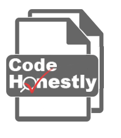

# CodeHonestly
### ->Utilize AST Graphs to Detect Code Plagiarism<-

`python run.py test-projec` to run the project

Note: please make sure there are at least two Python files in data folder, not any subfolder.

Website: https://www.codehonestly.com/

This project was founded in DSC 180B, a capstone project for data science undergraduate students at UCSD.
